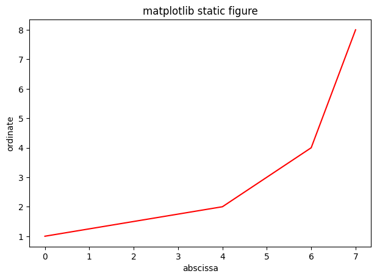
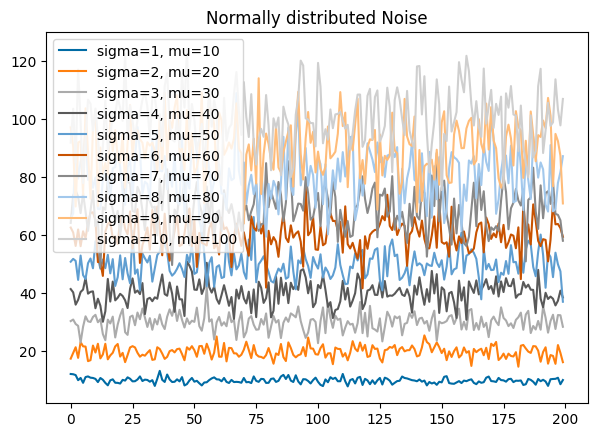

.. interplot documentation master file, created by
   sphinx-quickstart on Fri Dec 29 11:00:12 2023.
   You can adapt this file completely to your liking, but it should at least
   contain the root `toctree` directive.

interplot
=========

Quick Start
-----------

.. toctree::
   :maxdepth: 2
   :caption: Contents:

.. toctree::
    :maxdepth: 2

    api_plot

.. toctree::
    :maxdepth: 1

    api_conf

.. toctree::
    :maxdepth: 2

    api_iter

.. contents:: On this page
    :depth: 3

.. mdinclude:: ../README.md

Examples
========

.. code-block:: python

   >>> interplot.line([0,4,6,7], [1,2,4,8])

.. raw:: html
     :file: ../source/plot_examples/basic_plot_pty.html

.. code-block:: python

   >>> interplot.line(
   ...     x=[0,4,6,7],
   ...     y=[1,2,4,8],
   ...     interactive=False,
   ...     color="red",
   ...     title="matplotlib static figure",
   ...     xlabel="abscissa",
   ...     ylabel="ordinate",
   ... )

.. code-block:: python

   >>> fig = interplot.Plot(
   ...     interactive=True,
   ...     title="Everything Under Control",
   ...     fig_size=(800, 500),
   ...     rows=1,
   ...     cols=2,
   ...     shared_yaxes=True,
   ...     save_fig=True,
   ...     save_format=("html", "png"),
   ...     # ...
   ... )
   ... fig.add_hist(np.random.normal(1, 0.5, 1000), row=0, col=0)
   ... fig.add_boxplot(
   ...     [
   ...         np.random.normal(20, 5, 1000),
   ...         np.random.normal(40, 8, 1000),
   ...         np.random.normal(60, 5, 1000),
   ...     ],
   ...     row=0,
   ...     col=1,
   ... )
   ... # ...
   ... fig.post_process()
   ... fig.show()
   saved figure at Everything-Under-Control.html
   saved figure at Everything-Under-Control.png

.. raw:: html
     :file: ../source/plot_examples/Everything-Under-Control.html

.. code-block:: python

   >>> @interplot.magic_plot
   ... def plot_lines(samples=100, n=10, label="sigma={0}, mu={1}", fig=None):
   ...     """
   ...     Plot Gaussian noise.
   ...
   ...     The function must accept the `fig` parameter from the decorator.
   ...     """
   ...     for i in range(1, n+1):
   ...         fig.add_line(
   ...             np.random.normal(i*10,i,samples),
   ...             label=label.format(i, i*10),
   ...         )

.. code-block:: python

   >>> plot_lines(samples=200, title="Normally distributed Noise")

.. raw:: html
     :file: ../source/plot_examples/gauss_plot_pty.html

.. code-block:: python

   >>> plot_lines(
   ...     samples=200, interactive=False, title="Normally distributed Noise")

|br|

.. note::
   More examples can be found on `NBViewer`_.

.. _NBViewer: https://nbviewer.org/github/janjoch/interplot/tree/main/demo/

.. |br| raw:: html

    

|br|

Indices and tables
==================

* :ref:`genindex`
* :ref:`modindex`
* :ref:`search`
